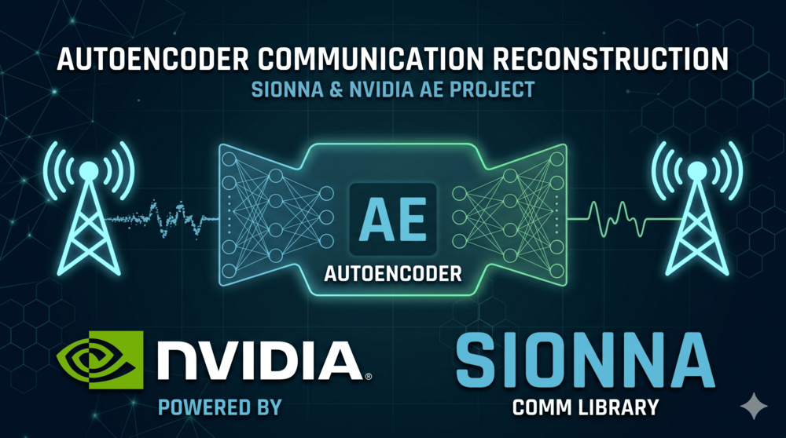

# Sionna Physical Layer Learning Notebooks 📡🧠

A hands-on study of NVIDIA's [Sionna](https://nvlabs.github.io/sionna/) physical layer simulation framework, covering fundamental concepts through end-to-end autoencoder design for wireless communications.

  

 

  

## 📋 Description

This repository documents my study of NVIDIA's Sionna physical layer simulation framework through three Jupyter notebooks. The work spans from basic Sionna building blocks and differentiable communication systems, to training a full end-to-end autoencoder over an AWGN channel using both conventional backpropagation and reinforcement learning.

## 📓 Notebooks

### Part 1 — Getting Started with Sionna (`Sionna_tutorial_part1.ipynb`)

An introduction to the core paradigms and components of Sionna.

**Topics covered:**
- Sionna's batching and data-flow design principles (`sionna.phy.Block` architecture)
- Random number generation and seeding for reproducibility
- QAM constellation design and mapping/demapping using `Constellation`, `Mapper`, and `Demapper`
- Transmitting symbols over an AWGN channel with `ebnodb2no` noise normalization
- Forward Error Correction (FEC) with 5G NR-compliant LDPC codes (`LDPC5GEncoder`, `LDPC5GDecoder`)
- Eager mode versus compiled (`torch.compile`) execution for performance
- Building a full uncoded AWGN transmission system as a reusable `Block`

---

### Part 2 — Differentiable Communication Systems (`Sionna_tutorial_part2.ipynb`)

Explores how Sionna enables gradient-based optimization of communication system parameters.

**Topics covered:**
- Making a QAM constellation trainable with `requires_grad=True` PyTorch tensors
- Forward pass through the end-to-end system with gradient tracking
- Binary Cross-Entropy (BCE) as a loss function — equivalent to maximizing an achievable information rate
- Computing gradients via `loss.backward()` through non-trainable differentiable Sionna blocks (demapper, channel)
- Applying SGD updates using `torch.optim.Adam`
- Implementing a custom trainable `Block` with `__init__` and `call` methods
- Setting up a training loop over a range of Eb/N0 values

---

### Autoencoder — End-to-End Learning (`Autoencoder.ipynb`)

Implements and trains a full end-to-end autoencoder for coded transmission over AWGN, comparing two training strategies.

**System model:** Trainable constellation (transmitter) → AWGN channel → Neural network demapper (receiver) → LDPC decoder

**Topics covered:**
- Neural network-based demapper (3-layer dense network with ReLU) that takes received complex samples and noise variance as input and outputs LLRs
- **Conventional SGD training**: Jointly trains the constellation geometry and neural demapper through backpropagation of the BCE loss
- **RL-based training**: Alternating training strategy that does not require a differentiable channel model — trains the receiver conventionally and the transmitter via reinforcement learning (policy gradient with additive perturbation noise)
- Post-alternating fine-tuning phase for the receiver
- Integration of 5G NR LDPC outer codes (`LDPC5GEncoder`, `LDPC5GDecoder`) at evaluation time
- BER evaluation with `sim_ber` across a sweep of Eb/N0 values
- Visualization of learned constellations versus standard QAM

## 🔧 Requirements

- Python 3.8+
- [Sionna](https://nvlabs.github.io/sionna/) (`pip install sionna`)
- PyTorch
- NumPy
- Matplotlib

All notebooks are designed to run on Google Colab (auto-installs Sionna) or locally with a GPU.

## 🤝 Contributing

Contributions are welcome! Feel free to extend the notebooks with new channel models, modulation schemes, or training strategies.

## 🙏 Acknowledgments

- [NVIDIA Sionna](https://nvlabs.github.io/sionna/) — open-source physical layer simulation framework
- Sionna official tutorial series for Beginners (Parts I–IV)
- F. Ait Aoudia and J. Hoydis, "End-to-End Learning for OFDM: From Neural Receivers to Pilotless Communication," IEEE TWC, 2022

 

  

## <!-- CONTACT -->
<!-- END CONTACT -->

## **Explore the frontier of AI-driven wireless communications with Sionna! 📡✨**
